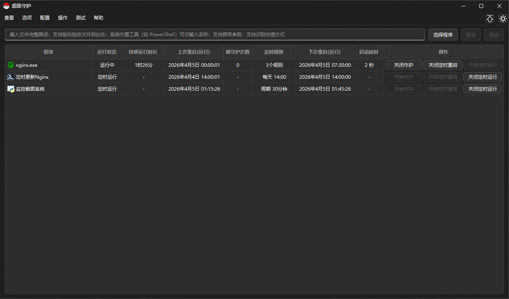
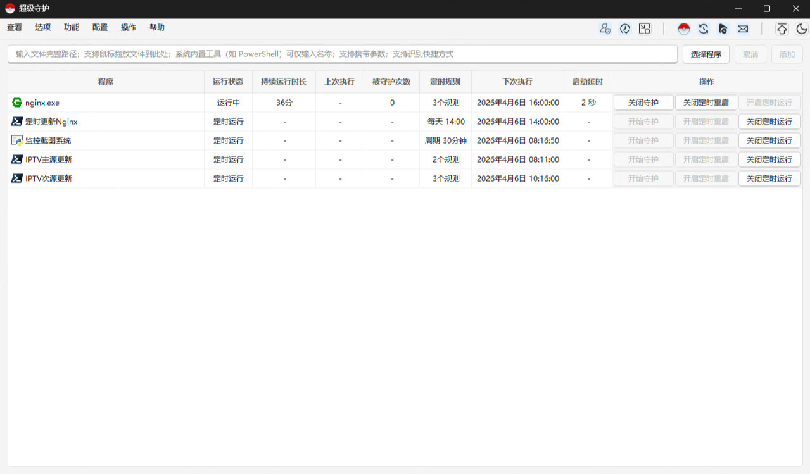
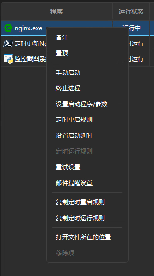

# SuperGuardian · 超级守护

> Windows 进程守护与定时管理工具 —— 实时监控指定程序，异常退出后自动重启，并提供定时重启、定时运行、启动延时、失败重试、邮件提醒、自我守护等完整保障机制。

---

## 版本限制

最低 Windows 版本：Windows 10 21H2
> 低于此版本可能可用但不保证。

最低 Windows Server 版本：Windows Server 2022（带桌面体验）
> Windows Server 2019 可能可用但不保证。

---

## 部分界面预览

<table>
  <tr>
    <td align="center"><b>暗色模式</b></td>
  </tr>
  <tr>
    <td></td>
  </tr>
  <tr>
    <td align="center"><b>浅色模式</b></td>
  </tr>
  <tr>
    <td></td>
  </tr>
  <tr>
    <td colspan="2" align="center"><b>右键菜单</b></td>
  </tr>
  <tr>
    <td colspan="2" align="center"></td>
  </tr>
</table>

---

## 功能概览

| 功能 | 说明 |
|------|------|
| 🛡️ 进程守护 | 实时监控指定程序，退出后自动拉起 |
| ⏰ 定时重启 | 支持任意数量规则（周期重复 / 固定时间 / 按星期），自动按计划重启程序 |
| 🕐 定时运行 | 与守护和定时重启互斥，按规则定时启动程序（不杀进程） |
| ⏳ 启动延时 | 程序退出后等待指定秒数再重启，避免与程序自身重启逻辑冲突 |
| 🔄 失败重试 | 启动失败后自动重试，可配置间隔、次数上限、时长上限 |
| 📧 邮件提醒 | 关键事件（启动失败、重试耗尽等）通过 SMTP 发送邮件通知，支持全局开关与每程序独立开关 |
| 🔁 自我守护 | 内置看门狗，SuperGuardian 自身崩溃后也能自动恢复 |
| 🚀 开机自启 | 一键写入 Windows 启动项，开机后自动运行 |
| 📌 列表置顶 | 任意程序可置顶显示，置顶项始终排在列表最前 |
| 📌 窗口置顶 | 主窗口可置顶到所有窗口之上，点击菜单栏右上角图钉按钮切换 |
| 🎨 明暗主题 | 首次启动自动识别系统主题，支持手动切换浅色 / 暗色模式 |
| 📋 配置管理 | 配置可导入 / 导出 / 重置，便于迁移和备份，支持从旧版 INI 格式自动迁移 |
| 📜 运行日志 | 操作日志、软件运行日志、守护日志、定时重启日志、定时运行日志分类存储，支持分页浏览、搜索过滤和清空 |
| 🔗 快捷方式 | 支持直接添加 `.lnk` 快捷方式，自动解析真实路径和参数 |
| 🪟 托盘常驻 | 关闭窗口后最小化至系统托盘，不影响桌面 |
| 🔽 启动时最小化 | 可选启动时仅显示托盘图标，不弹出主界面 |
| 🔃 列排序 | 点击表头排序（升序→降序→默认循环），排序状态跨重启保留 |
| 👁️ 列显隐 | 右键表头可勾选显示/隐藏任意数据列（"操作"列除外），设置永久保留 |
| 🔀 表头拖动 | 拖动表头可自由调整列的显示顺序（"操作"列始终在最右），顺序永久保留 |
| ↔️ 列宽调整 | 拖动列宽自定义，可通过菜单重置；列宽跨重启保留 |
| 🔄 本地更新 | 选择新版本 `.exe` 或 `.zip` 文件一键更新，自动备份旧版本（最多保留 5 个），支持恢复旧版本 |
| 🔀 允许重复添加 | 可配置允许重复添加的程序白名单，系统内置工具默认允许重复 |
| 📎 导出诊断信息 | 一键导出系统信息、当前配置、守护项状态和近期日志，便于排查问题 |

---

## 界面预览

程序主界面包含一个程序列表和顶部输入栏。列表包含以下 10 列：

| 列名 | 默认显示 | 说明 |
|------|----------|------|
| 程序 | ✅ | 程序文件名及图标，设置备注后显示备注名称 |
| 运行状态 | ✅ | 运行中 / 未运行 / 未守护 / 已重启 / 定时运行 |
| 持续运行时长 | ✅ | 程序在操作系统中的持续运行时间（与守护状态无关，进程重启后清零） |
| 上次重启(运行) | ✅ | 最近一次守护/定时重启/定时运行的时间戳 |
| 被守护次数 | ✅ | 守护触发重启的累计次数（关闭守护时清零；定时运行时显示"-"） |
| 持续守护时长 | ❌ | 从开启守护起的累计时间（关闭守护后清零），默认隐藏 |
| 定时规则 | ✅ | 当前配置的定时重启或定时运行规则（支持多条） |
| 下次重启(运行) | ✅ | 下一次定时重启或定时运行的预计时间 |
| 启动延时 | ✅ | 触发守护/定时重启前的等待时长（秒），定时运行时显示"-" |
| 操作 | ✅ | 开始守护/关闭守护 · 开启定时重启/关闭定时重启 · 开启定时运行/关闭定时运行 |

**列表交互：**

- 双击列表中程序的任意列（除"操作"列）可快速打开 **"设置启动程序/参数"** 对话框
- 拖动程序行可调整排列顺序，支持多选批量拖动，拖动后的顺序将成为新的默认排序
- 键盘 **↑↓** 方向键可在列表中导航
- 键盘 **F2** 可为选中行设置备注
- 键盘 **Delete** 可删除选中行（需确认）
- 列宽支持拖动自定义，可通过菜单 **操作 → 重置列表所有列宽** 还原默认比例
- 点击表头可排序（升序→降序→默认循环），排序状态跨软件重启保留
- 右键点击表头（"操作"列除外）可打开列显隐菜单，勾选/取消勾选以显示或隐藏列
- 拖动表头可调整列的显示顺序（"操作"列始终固定在最右），顺序永久保留
- 通过菜单 **操作 → 重置表头显示** 可将表头的显示项和排列顺序恢复到默认值
- 列表中文字显示不全时，鼠标悬停可查看完整内容

---

## 快速上手

### 添加程序

有三种方式将程序加入守护列表：

1. **拖放**：直接将 `.exe` 或 `.lnk` 文件拖入顶部输入框
2. **浏览**：点击"选择程序"按钮，通过文件对话框选取
3. **手动输入**：在输入框中输入程序路径或名称，点击"添加"或按 **Enter** 键

**输入格式：**

- 完整路径：`C:\Windows\System32\notepad.exe`
- 带引号路径（路径含空格时）：`"C:\Program Files\app.exe"`
- 系统程序名称（不区分大小写）：`cmd`、`PowerShell`、`notepad`、`ping` 等，自动在系统 PATH 中查找完整路径
- 路径 + 启动参数：`cmd /k`、`notepad C:\test.txt`、`"C:\Program Files\app.exe" --arg1`
- 快捷方式路径：输入 `.lnk` 文件路径，自动解析快捷方式目标程序及其参数

> 同一路径不会重复添加（可通过**配置 → 允许重复添加的程序**管理白名单）。所有输入框右键菜单已汉化，保留原始图标与快捷键样式（撤销、重做、剪切、复制、粘贴、删除、全选）。

### 开启守护

- 点击列表行末的 **"开始守护"** 按钮
- 若程序当前未运行，守护开启后将立即启动程序
- 关闭守护后，被守护次数和持续守护时长自动清零

> 💡 双击列表中程序的任意列（除"操作"列）可快速打开 **"设置启动程序/参数"** 对话框。

### 开启定时重启

- 点击列表行末的 **"开启定时重启"** 按钮，或右键选择 **"定时重启规则"**
- 支持添加多条规则，每条规则可选择：
  - **周期重复**：按天、小时、分钟组合设置间隔
  - **固定时间**：指定时间点，可按星期筛选（不选则每天执行）
- 规则支持右键复制/粘贴（粘贴有效期 2 小时），也可在不同程序间复制
- 关闭定时重启后，已设置的规则参数会保留，下次开启时自动恢复
- 定时重启与守护**相互独立**，可单独启用；与定时运行**互斥**

### 开启定时运行

- 点击列表行末的 **"开启定时运行"** 按钮，或右键选择 **"定时运行规则"**
- 与定时重启规则配置方式相同，但不会终止已有进程，仅在触发时启动程序
- 可选择是否 **监控持续运行时长**（在列表中显示进程运行时间）
- 关闭定时运行后，已设置的规则参数会保留，下次开启时自动恢复
- 开启定时运行时，守护和定时重启会自动禁用

---

## 列表置顶

> **菜单路径：** 右键菜单 → 置顶 / 取消置顶

置顶功能让重要程序始终显示在列表最前面：

- 右键单击程序，选择 **"置顶"**，该程序将在程序图标前显示置顶图标并移到列表顶部
- 置顶图标自动适配主题：浅色模式使用深色图标，暗色模式使用浅色图标
- 支持多选后批量置顶/取消置顶
- 点击表头排序时，置顶的程序与未置顶的程序分别在各自区域内独立排序

---

## 窗口置顶

> **操作方式：** 点击菜单栏右上角的图钉按钮

将 SuperGuardian 主窗口置顶到所有窗口之上，再次点击可取消置顶。状态跨重启保留。

---

## 启动延时

> **菜单路径：** 右键菜单 → 设置启动延时

当守护的程序自身带有更新机制或内置重启逻辑时，程序退出后会在极短时间内自行重启。若守护进程在此期间也触发重启，可能导致程序被多次拉起。

**启动延时**功能解决了这一问题：在程序退出后，等待配置的秒数后再执行守护重启，给程序自身预留充足的重启窗口。

- 单位：秒（可设置 0 ~ 86400）
- 默认 1 秒，设置为 0 关闭延时
- 守护重启、定时重启均使用此延时；定时运行不使用此项

---

## 失败重试

> **菜单路径：** 右键菜单 → 重试设置

当守护启动、定时重启或定时运行启动失败时，自动进入重试流程：

| 参数 | 默认值 | 说明 |
|------|--------|------|
| 重试间隔 | 30 秒 | 每次重试之间的等待时间（5 ~ 3600 秒） |
| 最大重试次数 | 10 次 | 0 = 无限制 |
| 最大重试时长 | 300 秒 | 0 = 无限制 |

重试成功后自动退出重试模式；重试耗尽后停止重试并可触发邮件通知。

---

## 邮件提醒

> **配置路径：** 配置 → 邮件提醒配置（SMTP 服务器设置）
>
> **开关路径：** 选项 → 邮件提醒（全局开关），或托盘右键菜单 → 邮件提醒

邮件提醒功能通过 SMTP 发送通知邮件（使用 PowerShell 的 `System.Net.Mail` 异步发送），支持两级开关：

1. **全局开关**：菜单栏"选项 → 邮件提醒"或托盘右键菜单，默认**关闭**
2. **每程序开关**：右键菜单 → 邮件提醒设置，默认**关闭**

SMTP 配置项包括：服务器地址、端口、TLS 开关、用户名、密码、发件人地址/名称、收件人地址。配置完成后可点击 **"发送测试邮件"** 验证。

可配置的提醒事件：

| 事件 | 默认 | 说明 |
|------|------|------|
| 守护触发重启 | 关 | 守护检测到进程退出并重启时 |
| 启动失败 | 开 | 程序启动失败时 |
| 定时重启失败 | 开 | 定时重启后启动失败时 |
| 定时运行失败 | 开 | 定时运行启动失败时 |
| 进程退出 | 关 | 守护的进程退出时（延时重启前） |
| 重试耗尽 | 开 | 重试次数/时长耗尽时 |

> **去重机制：** 失败类事件在下次成功之前只提醒一次，避免重复邮件轰炸。

---

## 自我守护

> **菜单路径：** 选项 → 自我守护，或托盘菜单 → 自我守护

开启后，SuperGuardian 会以看门狗模式启动自身的一个子进程（`--watchdog` 参数）持续监控主进程。若主进程意外崩溃，看门狗将自动将其重启（最多重试 5 次，失败后指数退避等待）。

**行为细节：**
- 通过菜单"退出"正常退出时，看门狗不会触发重启（写入 `self_guard_manual_exit` 标志）
- 可通过 **测试 → 测试自我守护** 强制结束主进程，验证恢复效果
- 看门狗事件记录在软件运行日志中

---

## 允许重复添加

> **配置路径：** 配置 → 允许重复添加的程序
>
> **测试路径：** 测试 → 测试程序是否允许重复添加

默认情况下，同一程序路径不允许重复添加到守护列表中。系统内置工具（如 PowerShell、cmd 等）默认允许重复添加。

- 添加程序时如输入 `.lnk` 快捷方式，自动解析真实路径后再进行重复判断
- 可通过 **配置 → 允许重复添加的程序** 管理白名单，支持搜索过滤、批量导入导出、拖放添加
- 通过 **测试 → 测试程序是否允许重复添加** 可验证某个程序是否被白名单覆盖

---

## 本地更新

> **菜单路径：** 帮助 → 更新

支持两种更新方式：

1. **EXE 更新**：选择新版本的 `SuperGuardian.exe`，直接替换当前程序
2. **ZIP 更新**：选择包含新版本的 `.zip` 压缩包，自动解压并替换

**更新流程：**
- 旧版本自动备份到 `bak/` 文件夹（按时间戳命名），最多保留 5 个历史版本
- 更新成功后软件自动重启以应用新版本
- 支持拖放文件到输入框快速选择更新文件

**恢复旧版本：**
- 在更新对话框中点击 **"恢复旧版本"** 按钮
- 从备份列表中选择要恢复的版本，确认后自动替换并重启

---

## 菜单栏

SuperGuardian 的菜单栏包含以下菜单，右上角有置顶按钮（📌）和主题切换按钮：

### 查看

| 菜单项 | 说明 |
|--------|------|
| 操作日志 | 查看用户操作记录（添加/移除程序、开关守护、配置变更等） |
| 软件运行日志 | 查看软件运行时事件（看门狗、重试、异常等） |
| 守护日志 | 查看守护触发重启记录 |
| 定时重启日志 | 查看定时重启触发记录 |
| 定时运行日志 | 查看定时运行触发记录 |

> 所有日志查看器支持搜索过滤、分页浏览（每页 500 条）和清空日志。

### 选项

| 菜单项 | 说明 |
|--------|------|
| 自我守护 | 开启/关闭看门狗自我守护（可勾选） |
| 开机自启 | 写入/移除 Windows 启动项（可勾选） |
| 邮件提醒 | 全局邮件提醒开关（可勾选） |
| 启动时最小化到托盘 | 启动时仅显示托盘图标（可勾选） |

### 配置

| 菜单项 | 说明 |
|--------|------|
| 导入 | 从 JSON 文件导入配置（支持追加或覆盖模式） |
| 导出 | 将当前配置导出为 JSON 文件 |
| 邮件提醒配置 | 配置 SMTP 服务器、发件人、收件人等，支持发送测试邮件 |
| 允许重复添加的程序 | 管理重复添加白名单（支持搜索、批量导入/导出、拖放） |
| 重置全部配置 | 恢复所有设置到默认值（需确认） |

### 操作

| 菜单项 | 说明 |
|--------|------|
| 清空列表 | 移除所有未激活守护/定时任务的程序 |
| 重置列表所有列宽 | 将所有列宽恢复到默认比例 |
| 重置表头显示 | 将表头的显示项和排列顺序恢复到默认值 |
| 关闭所有守护 | 批量关闭所有程序的守护 |
| 关闭所有定时重启 | 批量关闭所有定时重启 |
| 关闭所有定时运行 | 批量关闭所有定时运行 |
| 移动软件窗口到居中位置 | 将主窗口移动到屏幕中央 |
| 添加桌面快捷方式 | 在桌面创建 SuperGuardian 的快捷方式 |

### 测试

| 菜单项 | 说明 |
|--------|------|
| 测试自我守护 | 强制结束主进程，验证看门狗恢复效果 |
| 测试程序是否允许重复添加 | 检测指定程序是否在重复添加白名单中 |

### 帮助

| 菜单项 | 说明 |
|--------|------|
| 更新 | 打开本地更新对话框（支持 EXE/ZIP 更新和恢复旧版本） |
| 导出诊断信息 | 导出系统信息、配置、守护状态和近期日志到文本文件 |
| 关于 超级守护 | 显示版本和软件信息 |

---

## 右键菜单

在列表中右键点击程序项可打开右键菜单（支持多选批量操作）：

| 菜单项 | 说明 |
|--------|------|
| 备注 | 为程序设置备注名称，列表中将显示备注而非文件名 |
| 置顶 / 取消置顶 | 将程序置顶或取消置顶 |
| 手动启动 | 手动启动程序（不开启守护） |
| 终止进程 | 终止程序进程（需确认） |
| 设置启动程序/参数 | 配置启动路径和命令行参数 |
| 定时重启规则 | 配置定时重启规则（定时运行开启时禁用） |
| 设置启动延时 | 设置守护重启前的等待秒数（定时运行开启时禁用） |
| 定时运行规则 | 配置定时运行规则（守护/定时重启开启时禁用） |
| 重试设置 | 配置失败重试的间隔、次数、时长 |
| 邮件提醒设置 | 配置该程序的邮件提醒事件 |
| 复制定时重启规则 | 复制当前程序的定时重启规则（单选时可用） |
| 复制定时运行规则 | 复制当前程序的定时运行规则（单选时可用） |
| 打开文件所在的位置 | 在资源管理器中定位程序文件（单选时可用） |
| 移除项 | 从列表中移除程序（守护/定时任务激活时禁用，需确认） |

---

## 托盘菜单

系统托盘图标右键菜单包含以下选项：

| 菜单项 | 说明 |
|--------|------|
| 自我守护 | 开启/关闭看门狗（可勾选，与菜单栏同步） |
| 开机自启 | 写入/移除 Windows 启动项（可勾选） |
| 邮件提醒 | 全局邮件提醒开关（可勾选，与菜单栏同步） |
| 启动时最小化到托盘 | 启动时仅显示托盘图标（可勾选） |
| 退出 | 退出软件 |

单击托盘图标可切换主窗口的显示/隐藏。

---

## 数据存储

所有配置和日志使用 SQLite 数据库存储，位于程序同级目录的 `data/` 文件夹下：

| 文件 | 内容 |
|------|------|
| `data/config.db` | 全部程序配置、守护状态、定时规则、SMTP 设置、界面偏好等 |
| `data/logs.db` | 所有日志（操作、运行、守护、定时重启、定时运行），每类日志上限 10 万条，超出后自动裁剪 |

> 首次启动时如检测到旧版 INI 配置文件，会自动迁移到 SQLite 数据库。

---

## 系统要求

- **操作系统：** Windows 10 / 11（x64）
- **运行时：** 无需额外运行时，单文件静态编译（Release 版本）
- **权限：** 普通用户权限即可运行，写入启动项需要当前用户注册表写入权限

---

## 从源码构建

### 环境准备

| 依赖 | 版本 |
|------|------|
| Visual Studio | 2022 / 2026（v145 工具集） |
| Qt | 6.11.0（需安装 Qt VS Tools 扩展） |
| Qt 静态编译（Release） | 运行 `build_static_qt.bat` 一键编译静态 Qt |

### 构建步骤

```bash
# 1. 克隆仓库
git clone https://github.com/Mrluy/SuperGuardian.git
cd SuperGuardian

# 2. 编译静态 Qt（Release 构建需要，约 15-30 分钟）
build_static_qt.bat

# 3. 用 Visual Studio 打开 SuperGuardian.vcxproj
#    - Debug 模式：使用 Qt 动态库，需 windeployqt 部署
#    - Release 模式：使用 Qt 静态库，输出单文件 exe

# 4. 打包发布
powershell -File tools/package-release.ps1 -Version "1.0"
```

### 打包脚本

| 脚本 | 用途 |
|------|------|
| `package.ps1` | 完整构建 + 打包（编译 → windeployqt → ZIP） |
| `tools/package-release.ps1` | 仅打包（不编译，适用于已编译的 Release 版本） |

打包输出格式：`SuperGuardian_v{版本}_{日期时间}.zip`

---

## Star History

<a href="https://www.star-history.com/?repos=Mrluy%2FSuperGuardian&type=date&legend=top-left">
 <picture>
   <source media="(prefers-color-scheme: dark)" srcset="https://api.star-history.com/chart?repos=Mrluy/SuperGuardian&type=date&theme=dark&legend=top-left" />
   <source media="(prefers-color-scheme: light)" srcset="https://api.star-history.com/chart?repos=Mrluy/SuperGuardian&type=date&legend=top-left" />
   
 </picture>
</a>
